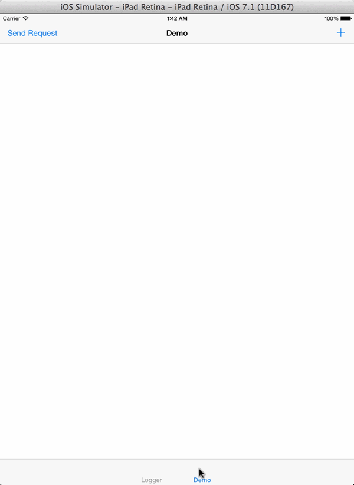

MALoggingViewController
==================

NOTE: This is has not yet been thoroughly tested and is in alpha, I would strongly advise against using this in any release builds.

MALoggingViewController is a real-time pseudo-console you can embed in your application, perfect for testing and debugging in the real world. Whether you are determining the reliability of network traffic while driving through areas with poor service, testing push notifications on ad-hoc builds while not connected to Xcode, or working out those pesky Core Location bugs, there's no need to carry around half of your development environment with you. No more driving around town with the Xcode console open, or having to handle logging to files and emailing them later to figure out what the heck happened - you can see all the data on your device, anywhere, in real time.

This is not meant to be a replacement for something like CocoaLumberjack, and is absolutely not optimized for speed or efficiency, but for day-to-day testing and debugging this is a pretty neat tool.


Usage
=====

Drop MALoggingViewController.h/m into your project, import the header into your AppDelegate.h, and create a MALoggingViewController property on your AppDelegate.

You can put your MALoggingViewController anywhere in your application, keep it somewhere super-secret hidden with a password, or rip it out entirely for all your production builds. When you're ready to start logging important information on screen, simply call logToView: and pass in an NSLog-type message with arguments and the result will be added to the MALoggingView as well as logged normally to the console. From anywhere else in your application, all you need to do is access the AppDelegate's MALoggingViewController property and tell it what and when to log.

```js
MALoggingViewController *loggingVC = [MALoggingViewController new];
self.logger = loggingVC;
[self.logger logToView:@"Some message goes here with param1: %@, param2: %@", firstParam, secondParam];
```





Community
=====

Questions, comments, issues, and pull requests welcomed!!


License
=====

This project is made available under the MIT license. See LICENSE.txt for details.
